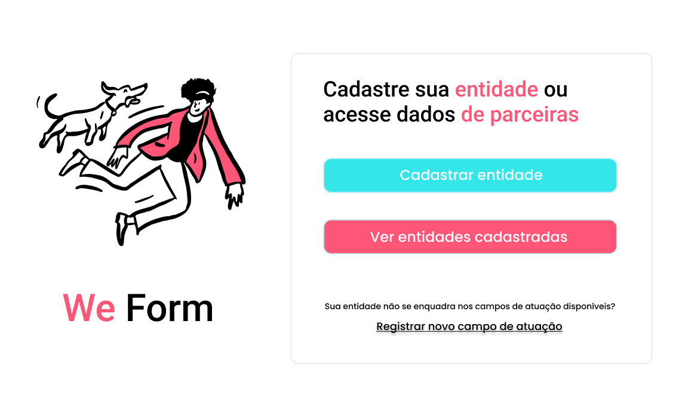

<h1 align="center"> Landing Page</h1>

  <a href="#-tecnologias">Tecnologias</a>&nbsp;&nbsp;&nbsp;|&nbsp;&nbsp;&nbsp;
  <a href="#-projeto">Projeto</a>&nbsp;&nbsp;

 

  

## 🚀 Tecnologias

Esse projeto foi desenvolvido com as seguintes tecnologias:

- HTML e CSS
- Git e Github
 

## 💻 Projeto

Landing page do intensivão da Rocketseat...

[🔗 Clique aqui para acessar](https://projeto-explore.vercel.app/)

---

Feito com ♥ by Daniel Kyochi 🌍

